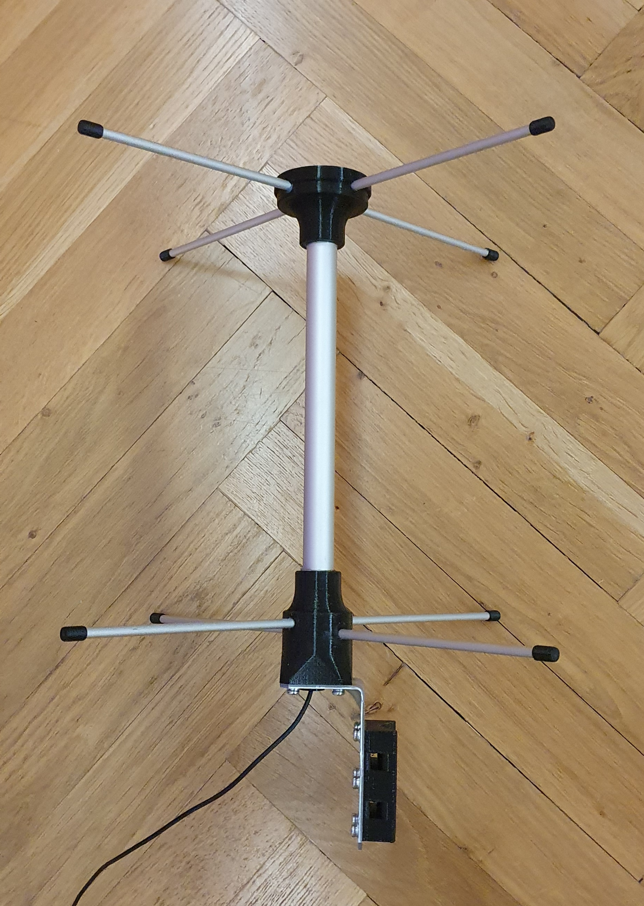

# Turnstile antenna
The antenna was primary designed for weather balloon tracker station based. It means my first dessign is for 403Mhz (400Mhz - 406Mhz). The solution is based on well know priciples which can be easily found on the Internet. The next one is planned for satelite receiver on 433 Mhz band.

## Mechanical design
All platic parts have been printed from PET on Prusa MK2 3D printer. Four perimeters and 80% infill have been chousen. 
Measurements of ALU parts are summarized below. Dipole pipes are fixed with four screws M3x16mm. They are used for cables connection as well. Reflector pipes are fixed with one screw in the tube joint inside the bottom plastic part. To make whole antenna wather proof silicone glu has been used.

## Turnstile antenna for 403Mhz

|Part|Description|
| :--- | :--- |
| **Dipole** | : 4 pcs of ALU pipe 6mm x 164mm |
| **Reflector** | : 2 pcs of ALU pipe 6mm x 354mm |
| **Pole** | 1 pc of ALU pipe 20mm x 262mm|
